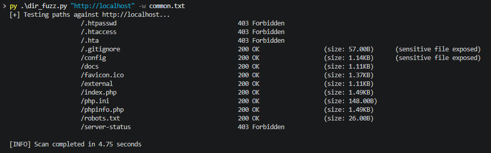
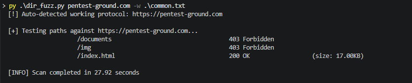
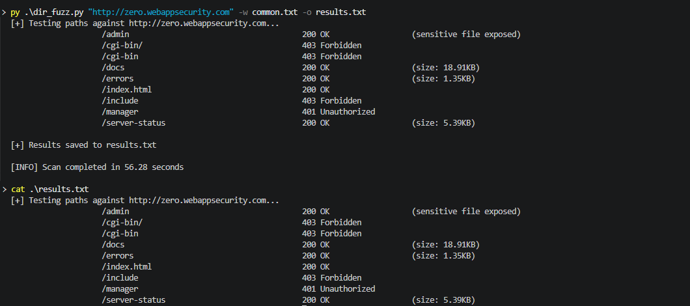

# web-path-finder
Python web path fuzzing tool designed to discover hidden directories, files, and exposed sensitive endpoints


## Features

- **Multi-threaded scanning** using `ThreadPoolExecutor` for fast execution
- **Size formatting** (B, KB, MB, GB)
- **Sensitive file detection** (`.env`, `.git`, `config`, `backup`, etc.)
- **Custom User-Agent** to reduce basic bot detection
- **Export results** to a text file (`-o`)
- **Automatic protocol detection** (tries HTTPS first, then HTTP)
- **Clean output formatting** with aligned columns
- **Configurable timeout and thread count** (1-1000 threads)
- **Execution time tracking** (scan duration reporting)

### Automatic Protocol Detection
If no protocol is specified, the tool automatically tries to detect a working one by attempting HTTPS first, then falling back to HTTP.

- **Note:** This feature only checks whether the URL starts with https:// or http://. It does not validate URL correctness. If a malformed URL is provided (e.g. https:/example.com), the tool will still prepend a protocol, which may result in invalid URLs such as https://https:/example.com.

---

## How it works:
- Generates paths from wordlist
- Sends concurrent HTTP requests
- Analyzes HTTP status codes and responses
- Filters and displays relevant results
- Tracks execution time

---

## Requirements

- Python 3.6+
- No external dependencies (uses only standard library modules)

---

## Installation

```bash
git clone <repo-url>
cd web-path-finder
```

---

## Usage

```bash
# Basic Scan
python dir_fuzz.py http://example.com -w common.txt

# Scan with custom threads and timeout
python dir_fuzz.py http://example.com -w common.txt -th 50 -t 5

# Save results to a file
python dir_fuzz.py http://example.com -w common.txt -o results.txt
```

---

## Known Limitations
- **Rate Limiting:** High thread counts may trigger 429 errors or temporary IP bans on strict servers.
- **Bot Detection:** Some advanced WAFs may still block requests despite the custom User-Agent.
- **HTTPS Stability:** Some HTTPS connections may hang or exceed the configured timeout due to urllib TLS behavior.

---

## Future Improvements

- [ ] Improve HTTPS stability and timeout handling
- [ ] Add progress indicator for large scans
- [ ] Allow custom status code filtering
- [ ] Add JSON/CSV output formats

---

## Demo

### DVWA (Local Test Environment)
Example scan against DVWA.



*Scan completed in 4.75 seconds*

---

### Pentest-Ground (HTTPS target)

Example scan executed against a public HTTPS testing environment without explicitly specifying the protocol.



*Scan completed in 27.92 seconds*

---

### Output file export example

Results saved using the `-o` flag and displayed using `cat`.



*Scan completed in 56.28 seconds*

---

## Wordlists

This tool does not include built-in wordlists.

You can use external collections such as:

- SecLists (recommended): https://github.com/danielmiessler/SecLists
- Custom wordlists depending on your target
---

## ⚠️ Disclaimer

This tool is provided for **authorized security testing and educational purposes**.

- Only use this tool on systems **you own** or **have explicit written permission** to test.
- Unauthorized access to computer systems is **illegal** and punishable by law.
- The author is not responsible for any misuse or damage caused by this software.

Use responsibly.
